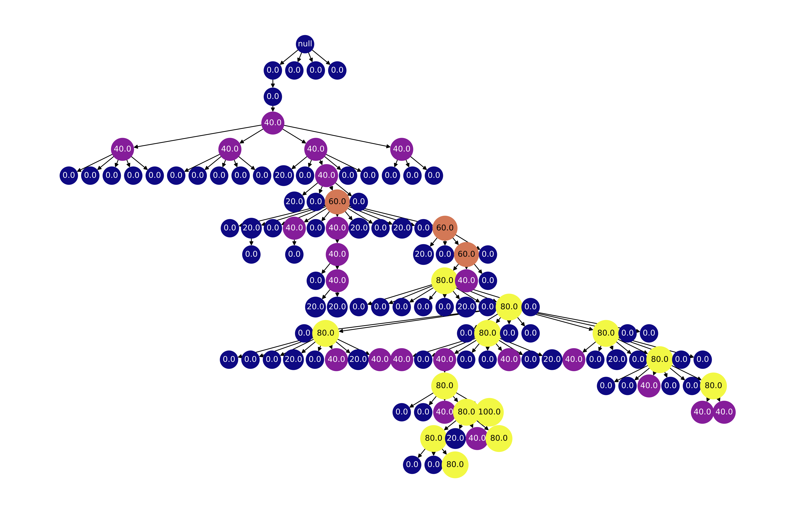
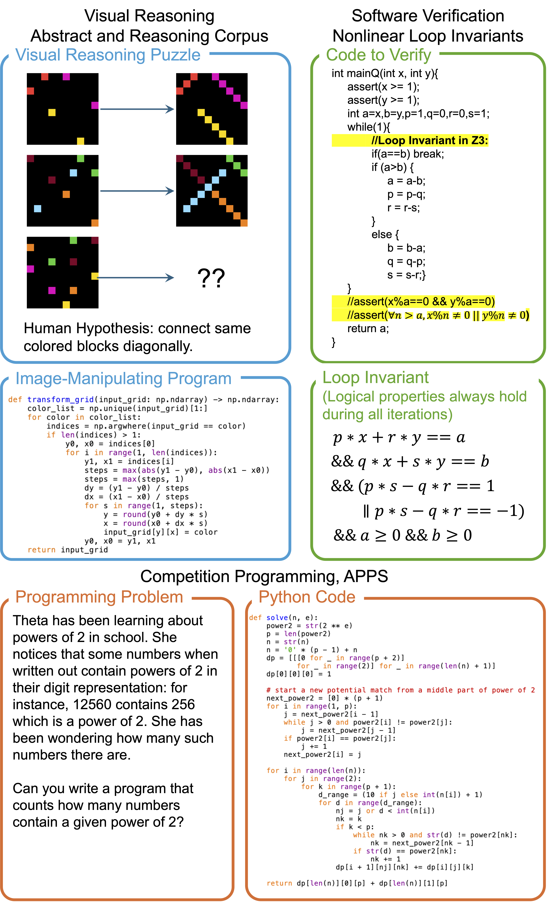
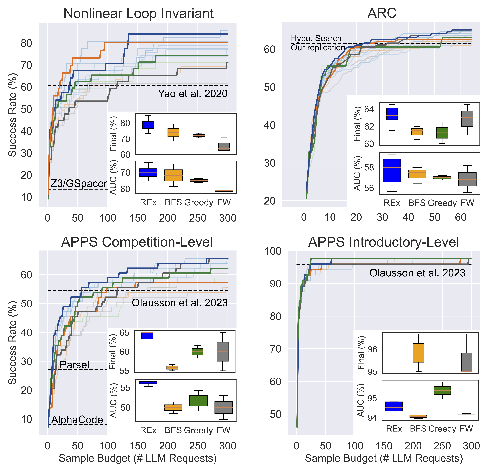
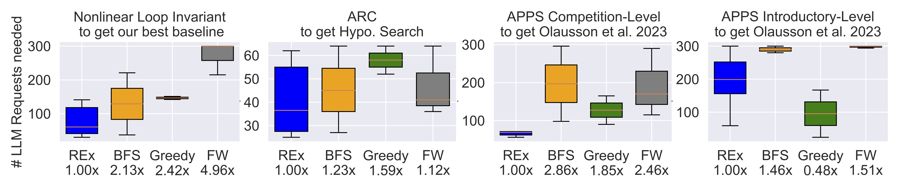

# REx: Code Repair with LLMs gives an Exploration-Exploitation Tradeoff

This is the official codebase of the paper

[Code Repair with LLMs gives an Exploration-Exploitation Tradeoff](https://arxiv.org/abs/2405.17503)\
[Hao Tang](https://haotang1995.github.io/), Keya Hu, [Jin Peng Zhou](https://scholar.google.com/citations?user=Nf48jqcAAAAJ&hl=en), [Sicheng Zhong](https://www.linkedin.com/in/si-cheng-zhong-9786881b6/), [Wei-Long Zheng](https://weilongzheng.github.io/), [Xujie Si](https://www.cs.toronto.edu/~six/), and [Kevin Ellis](https://www.cs.cornell.edu/~ellisk/)

## Overview
REx (Refine, Explore, Exploit) is a simple yet effective adaptive code repair algorithm. We show that refinement exposes an explore-exploit tradeoff: exploit by refining the program that passes the most test cases, or explore by refining a lesser considered program. We frame this as an arm-acquiring bandit problem, which we solve with Thompson Sampling. The resulting LLM-based program synthesis algorithm is broadly applicable: Across loop invariant synthesis, visual reasoning puzzles, and competition programming problems, we find that our new method can solve more problems using fewer language model calls.


Example search tree generated by REx. Blue→Yellow gradient indicates heuristic value (blue: low, yellow: high). The order of children from left to right indicates the sequence of generations (left: older, right: newer). 

## Installation

```
conda env create -f environment.yml
```

Key packages:
* OpenAI: `tiktoken, openai`
* Z3 for LoopInv: `z3-solver`
* Utilities: `dill, networkx, numpy, ...` (for caching, visualization, etc.) 

## Examples

### Loop Invariant Synthesis
Run REx for LoopInv with C=20
```
python -m acr.run --domain loop_inv --scheduler rex --rex-constant 20
```

Run fixed-width with width (how many initializations) 100 and depth 3 (means two more rounds of refinement). 

```
python -m acr.run --domain loop_inv  --scheduler fw --fw-width 100 --fw-depth 3
```

### ARC

Run REx for ARC with C=20

```
python -m acr.run --domain arc --scheduler rex --rex-constant 20 --llm-model gpt-4-turbo
```

Run bfs with branching 3

```
python -m acr.run --domain arc--scheduler bfs --llm-model gpt-4-turbo --bfs-branching 3
```

### APPS

Download APPS: 
```
cd acr/domains/apps/data/benchmarks 
wget https://people.eecs.berkeley.edu/~hendrycks/APPS.tar.gz 
tar -xzvf APPS.tar.gz
```

Run REx for APPS-Competition

```
python -m acr.run --domain apps --apps-difficulty comp --scheduler rex --rex-constant 20
```

Run REx for APPS-Interview

```
python -m acr.run --domain apps --apps-difficulty interview --scheduler rex --rex-constant 20
```

Run REx for APPS-Interview

```
python -m acr.run --domain apps --apps-difficulty intro --scheduler rex --rex-constant 20
```

## New Domain
REx is simple to implement as shown in [./acr/scheduler/rex.py](./acr/scheduler/rex.py). Feel free to implement it in any way in another repo. To add a new domain in this repo, add one in `./acr/domains` and implement 
* `domain.reset`: task_id -> action_list 
* `domain.step`: action -> reward, done, new_action_list
* (optional) `domain.get_metrics`: NULL -> dict

as the other domains.

## Results

Evaluation domains. For visual reasoning, the goal is to synthesize an image-manipulating program that translates input images to the correct outputs. For software verification, the goal is to synthesize logical conditions as a valid loop invariant, in order to formally verify the functionality of the code. For competition programming, the goal is to generate an algorithm in Python.



Comparing REx with alternatives. BFS and FW are Breadth First Search and Fixed Width, respectively. AUC denotes Area Under the Curve, and Final denotes the success rate at the maximum # LLM calls (64 for ARC and 300 for others due to domain conventions). Dark lines show performance with the best hyper-parameter setting for each method. Light lines show each run on each hyperparameter. The inset box plots show the distribution while varying the hyper-parameters.



Number of LLM Requests needed to get the best LLM-based state-of-the-art methods (for ARC, APPS) and the best LLM-based baseline (for Nonlinear Loop Invariant). The lower the better. Box plot shows range of results across hyperparameters. "x" denotes the factor by which our method is faster than the compared baseline on this benchmark (ratio of median #LLM calls).

